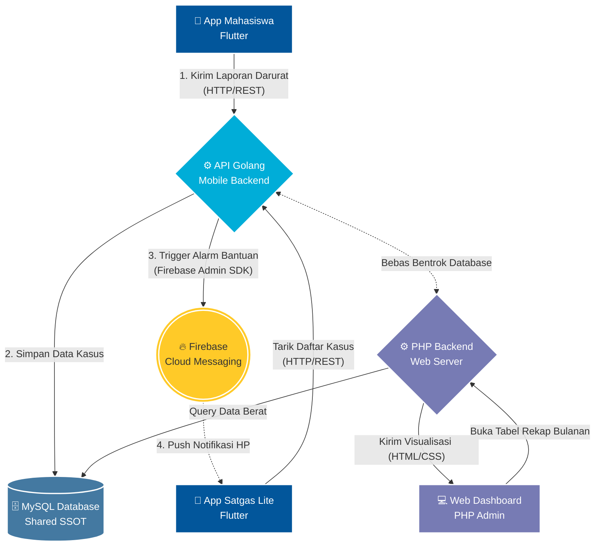

# 🏛️ GRAND DESIGN & TECH STACK ARCHITECTURE SIGAP

Dokumen ini menjelaskan rancangan arsitektur tingkat tinggi (*high-level architecture*) untuk ekosistem SIGAP. Sistem ini dirancang menggunakan pendekatan **Polyglot / Pendekatan Hibrida**, di mana berbagai bahasa dan ekosistem teknologi digabungkan untuk mendapatkan performa terbaik di setiap bidang fungsional pembagian tugas.

---

## 🎨 1. Pembagian Peran Teknologi (The Grand Tech Stack)

| Komponen | Teknologi Utama | Peran & Fungsi Utama |
|----------|----------------|----------------------|
| **Mobile App** | **Flutter** (Dart) | Antarmuka untuk Mahasiswa (Pelaporan) dan Satgas (Mode Darurat Admin & Psikolog). |
| **Web Dashboard** | **PHP** (Native/Framework) | Antarmuka operasional berat untuk Rektor / Kepala Satgas (Data tabel, statistik, generate PDF/Excel, rekam medik penuh). |
| **Mobile Backend API**| **Golang** (Go) | Mesin API ultra-cepat yang melayani *request* dari aplikasi mobile. Khusus menangani lalu lintas tinggi dan *concurrency* saat ada kedaruratan. |
| **Database Sistem** | **MySQL** | *Single Source of Truth* (SSOT). Tempat penyimpanan mutlak seluruh data (user, kasus, log). Digunakan bersama (di-*share*) antara PHP dan Golang. |
| **Notifikasi Darurat** | **Firebase** (FCM) | Sebagai "Sirine/Alarm". Bertugas menembak *Push Notification* pop-up ke layar HP satgas murni untuk pemberitahuan darurat. Meringankan beban database. |

---

## 📊 2. Visualisasi Arsitektur (Data Flow)

Berikut adalah bagan visual bagaimana semua teknologi ini saling berkomunikasi:

---

## 🔄 3. Simulasi *Workflow* Sistem Berjalan

Agar tervisualisasi lebih jelas, berikut adalah contoh bagaimana tumpukan teknologi (Tech Stack) ini bekerja ketika ada kejadian di lapangan:

### Skenario A: Mahasiswa Mengalami Kedaruratan (Alur Golang)
1. **[Flutter]** Mahasiswa menekan tombol **"Lapor Darurat"**.
2. **[Go]** Aplikasi memanggil *Endpoint Golang* (`POST api/v1/cases/emergency`).
3. **[Go & MySQL]** Engine Golang yang gesit dalam sepersekian detik langsung menyimpan data kronologi ke tabel *MySQL*.
4. **[Go & Firebase]** Skrip Golang melihat status `"darurat"`, lalu secara paralel memanggil API Firebase FCM: *"Firebase, minta tolong bunyikan HP Admin sekarang!"*
5. **[Firebase & Flutter]** HP Admin yang ada di kantong bergetar. Muncul pop-up dari SIGAP: *"DARURAT BARU: Ancaman di Fakultas Teknik!"*
6. **[Flutter]** Admin klik notifikasi, otomatis terbuka bagian `admin_lite_page.dart` untuk segera melakukan *Swipe* Tangani Kasus.

### Skenario B: Audit Data Akhir Bulan (Alur PHP)
1. **[PHP Frontend]** Kepala Satgas membuka laptop, mengakses `website-satgas/Admin`.
2. **[PHP Backend]** Website langsung membaca tabel *MySQL*. Karena PHP sangat mumpuni merekayasa HTML secara *Server-Side Render*, PHP langsung memuntahkan grafik interaktif, laporan rekam medik, dan tabel sortir kompleks.
3. **[Aman]** Tidak ada beban sedikitpun yang dirasakan oleh aplikasi Golang atau HP Mahasiswa. Proses berat *Web* tidak akan membuat *App* di HP patah-patah (*Drop FPS*), karena beban pemroseannya terpisah (Mesin Web PHP vs Mesin App Golang).

---

## ⚠️ 4. Titik Kesimpulan & Evaluasi Tahap Kerja
*Dengan disepakatinya arsitektur Golang + PHP ini, maka ada satu evaluasi penting:*

**Tujuan Migrasi (Peralihan Pendekatan):**
Pada **Fase 2** di rancangan roadmap lalu, kita membuat file `api_notifikasi_siaga.php`. Mengacu pada dokumen Grand Design ini, praktik tersebut **harus dihentikan/tidak digunakan ke aplikasi**. 

**Tindakan Lanjut (Next Langkah):**
Aplikasi Mobile (Flutter) saat ini secara resmi **hanya akan ditembakkan ke endpoint Golang**. Oleh karena itu:
- Tim Backend/Anda perlu membuat folder *repository* backend Golang (misal: `sigap-golang-api/` atau sejenisnya).
- Endpoint Mobile App yang ada dalam Web PHP hanya dibiarkan saja sebagai rintisan awal (*legacy*), dan pembangunan penuh API Mobile dikerjakan via ekosistem Go.

**Status Kemewahan Proyek:**
Pemisahan Microservice semacam ini (*Golang for Mobile API, PHP for Web Render, Firebase for Pushes*) menempatkan sistem SIGAP pada standar Tier-Enterprise/Corporate Architecture yang sangat tangguh di skala universitas.
